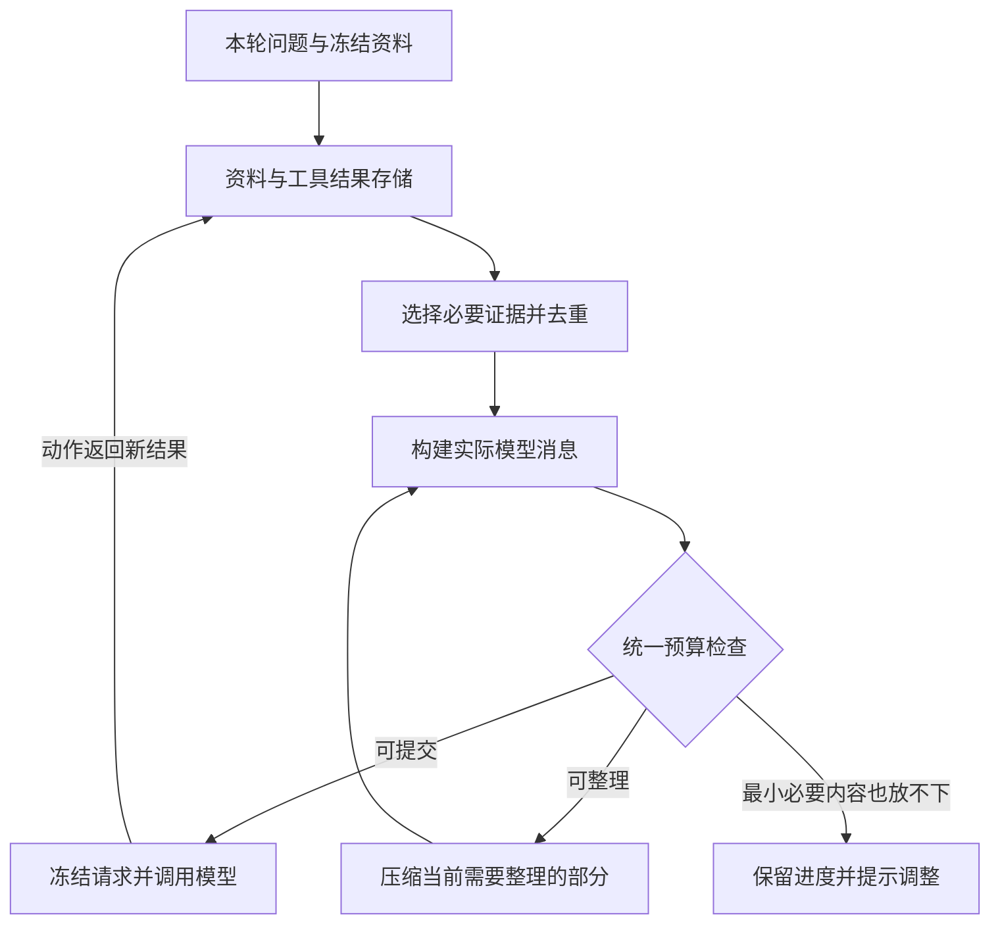

> 构建 32 更新：建议摘要目标与实际空间分开，工具结果优先整理；新增可选快速整理、按账号与会话隔离的分块摘要缓存和任务输出预算。恢复、缓存边界及验证见 [当前实现说明](RELEASE_1_0_0_BUILD_32.md)。下方保留已有设计及历史说明，以本轮说明为准。

# MailPilot：统一请求预算与可恢复资料整理设计

日期：2026-09-10。状态：已落实至 1.0.0（31），验证结果见 [交付说明](RELEASE_1_0_0_BUILD_31.md)。下文保留设计依据；实现使用 `PreparedModelRequest`（冻结请求和预算报告）、`EvidenceView`（本轮授权来源视图）、`CompressionPacker`（完整请求装填）与游标版本 2。沿用现有轮次及来源存储，不额外建立重复的 ContextBundle 数据副本。

## 1. 这次故障的证据

只读检查用户指定的 MailPilot_API36 设备，取得最新失败轮次的预算、阶段和缓存计数。未调用真实模型、搜索或邮箱服务；临时数据库副本读取后已删除，不在本文保存正文、查询词或凭据。

| 项目 | 设备记录 |
| --- | ---: |
| 型号 | doubao-seed-evolving |
| 配置上下文 | 32,768 |
| 有效输入预算 | 24,576 |
| 被本地拦截的请求估算 | 27,541 |
| 失败阶段 | compression |
| 搜索结果缓存 | 两条查询各已有 5 个结果 |
| 工具动作 | 已完成 1 轮 |
| 图片缓存命中 | 5 张 |
| 本轮上传图片 | 0 张 |
| 工具结果整理进度 | 共 5 批，已完成 1 批 |
| 最新成功摘要估算 | 640 |

当前预算计算为 32,768 − 4,096 输出预留 − 4,096 思考预留 = 24,576。这里的额度是应用对当前配置的计算，不代表厂商确认该型号或套餐最大只能输入这么多。

错误发生在整理下一批资料的本地预检，不能据此判断服务端上下文已满。诊断中的 `finishReason=complete` 来自上一批成功摘要，与后续批次的本地预算错误混在一起，也需要分开记录。

## 2. 代码中的问题

1. `ContextReducer` 依据片段原文估算分块，再把“旧摘要＋新片段”包成 JSON 字符串，加入系统提示及消息外层。它只在最终预检时发现超限，没有按这个最终结构重新装填当前批次。
2. 文本动作适配器把搜索结果 JSON 作为工具消息的字符串，再包进 JSON 数组和用户消息；整理时又把整条消息转成 JSON 文本。这使引号、反斜杠和换行反复转义。该轮工具反馈内容估算约 66,048，消息序列化后约 71,012，远超本轮输入预算。
3. 搜索执行、对话状态、持久化检查点和模型输入共用了过多相同的大对象。已保存的网页内容应可引用，但当前主要依赖把整份结果继续放入上下文。
4. 当前 Token 估算采用字符和 UTF-8 字节的保守值，不是厂商 tokenizer；又包含部分传输 JSON 的开销。真实 Token、保守估算和请求体字节没有清楚区分。
5. 火山套餐接口的上下文规格尚未核实，因此当前保留了原 32,768 配置。这放大了预算压力，但不是压缩器可以构造超限请求的理由。不能未经核实直接套用标准接口的较大额度。
6. 本次回归缺少“较小上下文＋两个较长搜索结果＋文本动作协议＋跨批次摘要”的组合。前一轮缓存修复通过后，才走到了这个后续问题。

## 3. 统一架构

保留现有通用动作循环，增加其所有模型调用共用的请求准备层：

`ContextBundle` 保存问题、历史、资料及工具结果的结构化引用；`PromptPlan` 保存本次真正要发送的消息和工具定义；`BudgetReport` 返回组成、估算依据、额度和处理建议。原生工具与文本协议使用相同证据和预算，分别负责最后的消息格式适配。

不新增独立意图分类请求，不引入 Python 后端或多 Agent 框架。普通图文问题预算足够时继续一次生成；现有图片数量、附件大小、账号隔离及发送确认限制保持有效。

## 4. 请求预算必须满足的约束

- 每一次回答、起草、读图、工具后续请求、摘要和摘要精简，都通过同一请求准备入口。
- 分开记录：模型逻辑输入 Token 估算、图片估算及可信程度、最终请求体字节。Base64 和传输转义不直接当成模型可见文字计量；嵌在实际 content 中的转义文本则必须计入。
- 有可核实的 tokenizer 或厂商计量规则时使用对应规则；其他型号保留标明不确定性的估算与余量。不能简单删除本地校验来掩盖问题。
- 输出自动模式继续表示“在已核实最大值及本次剩余空间内取可用上限”；不能预留整个型号理论最大输出而挤掉输入。保留用户自定义值，不静默修改思考开关。
- 保留用户确认的 95% 整理触发和 60% 目标。每次新资料或工具结果加入后重新检查，不能只检查最初的问题。60% 是整理目标；如近期完整对话等不可压缩部分已超过目标但仍可安全提交，不因此判定整轮失败。
- 请求通过预检后冻结消息、工具及预算摘要；实际发送使用同一份内容。内容变化则预算失效，必须重新准备。

## 5. 修复压缩器的具体算法

1. 先构造当前阶段的固定提示、旧摘要和消息容器，测算实际开销。
2. 从未完成位置按段落、句子及 Unicode 边界逐步装入新片段，用同一个消息构建器测量完整候选请求。
3. 候选请求超过批次预算时，在本地缩小片段，直到完整请求符合预算；本地装填调整不消耗模型调用次数，也不重跑已完成批次。
4. 连一段都放不下时，进一步拆分这段；旧摘要自身过大则先用能容纳的小请求精简旧摘要。最小固定内容仍放不下时才进入需要用户调整的状态。
5. 每批成功后记录已消费的来源片段／字符位置与摘要，不只保存批次序号。这样改变分块大小、退出应用或恢复时不会错位、漏段或重复处理。
6. 保留整项压缩任务最多两次“完整但过长摘要”的额外精简限制。空摘要、模型截断、断流、错误结构分别处理。无进展时停止，不无限自动请求。
7. 原始聊天、来源全文和有效旧摘要保留；只有所有必要片段覆盖且结果验证成功才更新正式记忆。以来源覆盖清单检查漏项，不把未处理资料描述为全部分析完成。

## 6. 工具结果只传必要内容

- 网页全文和原始工具响应保存在现有轮次／来源存储，使用账号、会话、轮次和内容版本约束的 `EvidenceRef` 引用。
- 模型首次看到的工具结果只包含来源编号、标题、网址、与任务相关的正文片段、完整性状态及可读取的范围。不传附件路径、空图片字段、缓存元数据等内部字段。
- 使用明确格式的正文块构建文本适配器反馈，不把“消息 JSON 的字符串”再次包成 JSON。原生工具仍保持合法的调用与结果配对。
- 按网址与内容指纹去重；同一段证据在历史、图片观察和工具结果中只进入当前请求一次。保留来源关系，综合多图结论不能随意归到单图。
- 当前问题需要更多细节时，允许受限的 `read_evidence` 按来源和范围读取已保存内容。它只能读当前会话允许使用的资料；不能借此访问未选邮箱正文、跨账号缓存或任意本地路径。
- 对“总结全部所选邮件”维护每封邮件／附件的覆盖记录，不能用只取前几段的方式假装完整总结。必要时在同一预算层内分段整理，最终保留来源与不确定性。

这种把大结果移出活跃上下文、保留引用并按需读取的方式，与 [LangChain Deep Agents 的上下文管理](https://docs.langchain.com/oss/python/deepagents/context-engineering)一致；其文档也将结果存储与历史摘要视为不同机制。本轮只借鉴机制，不照搬其默认阈值。

## 7. 恢复、诊断及交互

- 检索已经成功后，后续压缩失败只恢复未完成压缩或最终回答；不得重新搜索或上传已命中的图片。
- 本地装填超限优先自动重规划；网络错误、模型截断和不可靠摘要继续保留内容、由用户手动重试。已收到的部分回答与新尝试不拼接。
- 检查点绑定账号、会话分支、原问题、资料版本、模型和预算策略版本；兼容旧记录，无法验证的旧临时检查点按原快照重新规划，原记录不删除。
- 将每个阶段的诊断分开保存：失败发生于本地准备还是服务端响应、哪一个批次、固定提示／历史／正文／工具结果分别占多少、估算可信程度、剩余进度。不能把上一批成功结束标记误显示为失败请求的结束原因。
- 正常显示“正在整理搜索结果”，只在处理期间出现。确实需要用户调整时，说明问题来源及已保留进度，提供“继续整理”“调整资料”“查看预算”；纯本地预算问题不只给“修改模型配置”。
- 已完成的思考保持“已思考”，不因后续整理失败改为“思考中断”。错误不包含邮件正文、密钥或完整提示词。

分阶段保存和恢复遵循 [LangGraph 检查点设计](https://docs.langchain.com/oss/python/langgraph/persistence)。模型始终没有 SMTP 发送工具，整理和恢复不改变发送状态。

## 8. 验收与实施顺序

第一步修复最终消息装填、序列化重复及阶段诊断；第二步抽取通用请求准备层与证据视图；第三步完善受限按需读取和恢复，随后进行完整回归。

必须新增的回归场景：

- 当前 32,768 配置、5 张图片缓存、两条搜索查询各返回长结果；总结成功，图片上传为 0、查询不重复。
- 模拟本次 27,541／24,576 的边界；压缩器重新装填后每个实际请求都不超预算。
- 引号、反斜杠、换行、中文、英文、长 URL、表格和嵌套 JSON；各阶段使用一致估算，不能出现分块检查通过而最终容器超限。
- 原生工具与文本适配器、95% 边界、60% 目标、最小必要内容超过预算、超长最近两轮。
- 第 2 批失败／取消／应用重启；第 1 批不重做、不漏内容；模型或资料版本变化时正确失效。
- 空摘要、截断、两次精简耗尽、工具不断增长、重复来源、跨账号及跨会话访问拦截。
- 资料覆盖、来源链接、姓名／日期／金额／修正连续性；未完成结果不可发送。

执行原生、Flutter、Lint 和指定 API 36 完整流程测试；合成服务与真实厂商验证分开记录。后续实施交付继续保持正式版本 1.0.0，内部构建号按实际新包递增，同签名覆盖安装保留数据。

可通过统一不变量和回归测试防止已知的“应用自己构造超限请求”问题。资料无限增长、厂商硬上限或未知 tokenizer 差异仍可能需要用户调整；目标是让这些情况可解释、保留成果并能恢复，而不是承诺任何输入都绝不超限。
