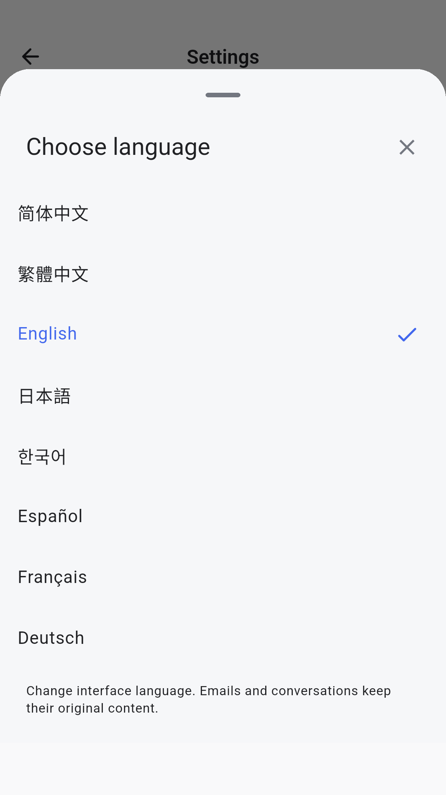

# MailPilot 1.0.0：八种界面语言

日期：2026-09-15。内部构建号 43，公开版本继续为 1.0.0，设置页不显示构建号。

## 优化前后

| 项目 | 构建 42 | 构建 43 |
| --- | --- | --- |
| 界面语言 | 简体中文写在各页面中 | 8 套本地资源，设置中切换 |
| 默认语言 | 简体中文 | 简体中文，不受系统语言影响 |
| 语言设置 | 无 | 设置 → 偏好设置 → 语言，立即生效并持久保存 |
| 数量、时间与系统控件 | 中文格式 | 按语言显示数量、日期和 Material 控件 |
| 邮箱预设 | 部分显示名称兼任标识 | 稳定标识与翻译后的名称分离 |
| 扩展方式 | 逐页替换文字 | ARB 资源、生成式访问器和完整性回归 |

支持简体中文、繁体中文、English、日本語、한국어、Español、Français、Deutsch。语言选择器始终使用各语言本名，切换后也能找回。

## 实现与范围

使用 Flutter 官方的 ARB、`gen-l10n` 和本地化代理，未增加在线翻译服务。8 套资源各包含 612 个消息项；带数量的主要消息使用 ICU 复数规则，插值由生成代码检查。[Flutter 国际化说明](https://docs.flutter.dev/ui/internationalization)

设置保存在 Android DataStore，旧安装缺省采用简体中文。未知语言值回退到简体中文，写入非法值会被拒绝。语言保存失败时保留原语言，并允许重试；保存期间不接受重复选择。

翻译覆盖导航、聊天控件、设置、邮件和草稿操作、模型与邮箱表单、资料与引用界面。邮件原文、用户输入、模型回答、用户命名和原生技术诊断保持原内容。切换界面语言不改写 Agent 提示词、邮件服务器地址、语音设置、模型配置或 SMTP 授权。

沿用构建 42 的阅读位置、展开卡片和暂停自动跟随行为。语言切换不清空输入，不重建会话、不发起模型或邮件请求。Room 保持 v9。

## 验证

- Flutter：489 项测试通过，其中 84 项为本轮新增。静态分析无问题。
- 设置和语言选择器：8 种语言 × 320／360／412 dp × 1.0／1.6／2.0 字体，共 72 组布局检查，含深色主题；检查无溢出及至少 48 dp 的选择区域。
- 行为：默认语言、保存失败、连续点击、重新创建控制器恢复、保留会话输入与滚动位置、各语言邮箱预设身份均有回归。
- MailPilot API36：隔离包 `app.mailpilot.validation` 验证八种语言真实持久化、拒绝非法值、重新读取后恢复，以及九张界面截图。测试未调用模型、联网搜索或 SMTP。
- 日常包：测试前后数据库完整性正常，17 张表及原有设置逐项校验未变化。日常包仍为构建 41，没有卸载或覆盖安装；因此本轮 API36 结果不冒充发布包覆盖升级验证。

原生单元测试 3 项通过；Lint 为 0 个错误、13 个提示，涉及目标 SDK、依赖新版本和 Kotlin 写法建议。本轮未为消除提示升级依赖。结果记录于 [验证清单](test-evidence/language43/verification.json)。[日常数据校验](test-evidence/language43/data-preserved.json)

## 审查与交付

资源键采用语义名称，业务标识不使用翻译文字。保留旧轮次识别需要的原始协议文本，未把用户资料或工具协议交给翻译层。源码打包包含 `l10n.yaml` 和 ARB 文件，可在干净工作区运行 `flutter pub get`、`flutter gen-l10n`、`flutter test`。

GitHub 仅包含源码、构建脚本、说明和合成界面截图；签名、数据库、用户配置、缓存和 APK 不进入 Git 历史。此前版本 Markdown 说明作为开发历史保留，历史原始截图和运行日志保留在本地归档中，不随本次首次推送上传。

正式签名 APK 和源码 ZIP 在本地 `artifacts` 交付，分别提供 SHA-256。版本来源为 `pubspec.yaml`，设置页只显示实际版本号和发送确认提示。
