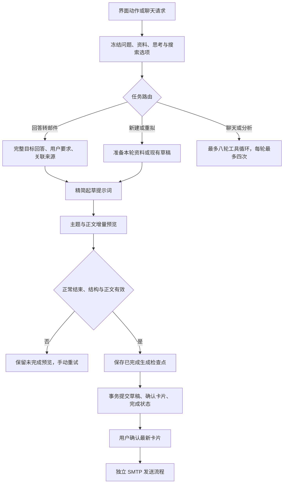

# MailPilot 1.0.0（20）· 稳定测试版

本版修复“总结邮件和 PDF 后，写成邮件中断”这条流程，并清理被新工作流替代的旧起草逻辑。包名和原签名保持不变，覆盖安装基线为 1.0.2（19）；Room 仍为 v8。

按用户 2026-09-09 的最新要求，原计划的 1.0.3 改为 **1.0.0（20）**，设置页与 APK 版本一致。待用户完成测试并确认放行后，下一版才使用 **1.0.1**。构建号不会回退，因此正式名称调整不阻碍覆盖安装。

## 使用变化

- 点击“写成邮件”，使用完整目标回答和关联来源，默认回复关联的唯一邮件发件人；明确指定收件人时优先使用用户地址。不再次下载或阅读该回答已分析的附件。
- 当前输入框的思考开关随起草、重拟一起保存。高级参数和模型配置不会被静默改变，新模型默认最大输出仍为 4096；已保存的自定义值不改。
- 起草过程中直接显示主题和正文的只读预览。正文未到达时不模拟文字；模型返回的实际思考仍可展开查看。
- 中断后显示“未完成 · 不能发送”，保留预览。点击“重试本轮”复用本轮资料处理检查点，新的输出替换旧预览，不拼接两次结果。
- 应用退出后再打开，未完成任务标为中断，由用户主动重试。草稿已经完整生成但保存阶段未完成时，恢复保存步骤。
- 只有完整结果通过校验并保存为正式确认卡片后，才可确认发送。生成失败发生在 SMTP 之前；不会自动换模型或重发邮件。
- 错误区分连接失败、连接超时、读取超时、请求总时限、异常断流、输出上限、服务过滤、格式错误和权限问题。错误下方可查看本轮连接诊断。接口拒绝 JSON 参数时，可手动选择兼容格式重试，思考开关保持原值。
- 连接诊断使用完整宽度的底部抽屉，分组显示阶段、模型和接口，阶段名称改为中文；请求标识和异常类型折叠在“技术详情”。大字体改为上下排列，长内容可滚动，右上角可关闭。

## Agent 架构

现有 Android 原生服务内实现任务路由、带检查点的起草工作流和受限工具循环，没有新增后端或运行 LangGraph 服务。

起草是单独的结构化工作流，不再混在八轮工具循环中。模型负责主题、正文或追问；应用负责发件账号、收件地址、ID、版本、附件与确认卡片。普通工具循环保留当前会话与邮箱范围校验，重复且无新结果的相同工具请求立即停止。模型没有 SMTP 工具。

检查点结构版本为 1，保存在原有 `conversation_turns.requestJson.agentRun`。中间结果包括文件提取、已完成视觉观察、搜索结果、长资料摘要、历史整理结果及部分预览；只在同一轮且来源/文件版本和条件匹配时复用。PDF 实际页码仍保存在该轮 `resolvedPdfPages`。完整生成结果接管检查点后删除重复中间缓存，事务成功后删除候选副本，正式草稿和来源由原表保存。删除会话或清理聊天同步清理孤立轮次。

流接收保留连接 20 秒、无网络数据读取 120 秒、单请求 600 秒上限。SSE 心跳属于网络活动。正常 `finish_reason` 或有效 `[DONE]` 触发校验与结束，不再等待无意义的尾部连接；关闭连接的尾部异常不会否定已接受的正常结果。关闭网络库自动重连。JSON 约束只用于已知官方型号与思考模式组合；其他接口使用同一提示词及本地校验。

诊断仅记录阶段、型号、接口主机、轮次/服务端请求标识、首末包相对时间、状态码、结束原因及异常类型，不记录密钥、邮件正文、附件或完整提示词。已完成思考与后续正文失败分别记录。

## 代码审查与清理

- 删除旧的“让模型生成收件人、草稿 ID、版本及确认卡片 JSON”的起草协议。
- 将单次起草移出工具循环，移除重复校验、误导性的提交包装、重复草稿 ID 状态与重复导入。
- 草稿只在协调层统一事务保存，清除生成器直接保存造成的分散提交逻辑；工具返回改为准确的候选状态。
- 合并输入框思考开关判定，所有起草入口通过同一选项快照传递。
- 修复 PDF 页码写入覆盖新检查点、预览定期保存改变聊天排序，以及完成结果被尾部连接异常覆盖的边界。
- 保留旧 JSON、旧草稿历史展示、来源编号、发送状态和数据库兼容读取；它们仍承担实际兼容功能，不属于可删除的冗余代码。

## 验证记录

2026-09-09 执行结果：

| 验证 | 结果 |
|---|---|
| Flutter 静态检查 | 无问题 |
| Flutter 单元与组件测试 | 192 项通过；包含 320／360／412 dp、深浅色及 1.0／1.6／2.0 字体的预览测试，新增抽屉宽度、长字段、折叠、关闭及大字体回归 |
| Android JVM 单元测试 | 131 项通过，2 项真实 IMAP 测试未启用而跳过；无失败 |
| Android Lint | 通过 |
| API 36 原生流程 | XML 记录 15 项通过、1 项真实 IMAP 跳过；含草稿恢复、事务、气泡分支、PDF、语音权限及 SMTP 本地测试 |
| API 36 Flutter 流程 | 起草预览、中断、诊断面板和手动重试通过，未触发发送 |
| 发布构建和签名 | Release 构建通过，签名与已交付的 1.0.2（19）相同 |
| 最终 APK 版本与启动 | API 36 实际安装显示 1.0.0／versionCode 20，启动成功，无 AndroidRuntime 致命异常 |
| 覆盖升级 | 较早的 1.0.3（20）构建已验证从 1.0.2（19）覆盖安装；改名及最终抽屉调整后，原 1.0.2 APK 不在原目录，最终包的覆盖复验未执行 |

本地模型服务验证了 SSE 心跳、只返回思考、分片 JSON、正常结束后无 `[DONE]`、延迟尾部、异常 EOF、读取超时、输出上限、过滤和取消。工作流测试覆盖完整回答仅加入一次、转换不再处理 PDF、思考设置透传、部分内容不可发送、重复保存幂等、事务回滚、旧 JSON 兼容、应用中断恢复、视觉结果缓存以及重复工具终止。

证据位于 [`test-evidence/build20-*`](test-evidence)，设备截图位于 [`screenshots/build20`](screenshots/build20)。预览截图使用明确标注的本地样例数据，不能作为真实厂商调用成功的证据。工具链仍提示将来需迁移 Kotlin Gradle Plugin；当前构建、测试及 Lint 均通过，本次没有夹带工具链升级。

APK SHA-256：`55da22b44e6b605e78e5bbee3624fadd48315a8b5e9ef612f8771dadffb2b757`。

签名证书 SHA-256：`0be84c66d74a7a2f8ccd8a39ee792f0c3b22fd942600307164f38ff93b3f2f17`。

真实厂商验证：当前环境未发现可用的 DeepSeek 或火山 API Key，本版没有进行真实厂商读图/起草请求，也没有向外部收件人发送测试邮件。模拟服务结果用于验证客户端协议和恢复行为，不能据此断言截图中的真实网络或服务端断流原因已消除。

设备测试复用已有 API 36 镜像，使用独立临时设备 MailPilot_103_Test36。最终 APK 启动测试只移除该临时设备上的调试样例，再安装正式包；没有卸载用户日常设备中的应用。测试后只清理本轮临时设备及其数据，保留日常 MailPilot_API36 和现有系统镜像。

## 设计依据

- [ReAct 原论文](https://arxiv.org/abs/2210.03629)：工具动作与观察之间的迭代。
- [Anthropic：Building effective agents](https://www.anthropic.com/engineering/building-effective-agents)：明确任务使用可预测工作流，开放任务使用工具循环。本版在已有 Android 服务中实现这一划分。
- [LangGraph 持久化说明](https://docs.langchain.com/oss/python/langgraph/persistence)：检查点和中断恢复的设计参考；本项目没有引入该框架依赖。
- [DeepSeek JSON 输出](https://api-docs.deepseek.com/guides/json_mode)、[心跳说明](https://api-docs.deepseek.com/quick_start/rate_limit)、[百炼结构化输出](https://help.aliyun.com/zh/model-studio/qwen-structured-output)：按官方协议和型号/思考模式选择 JSON 参数，保留本地验证。

