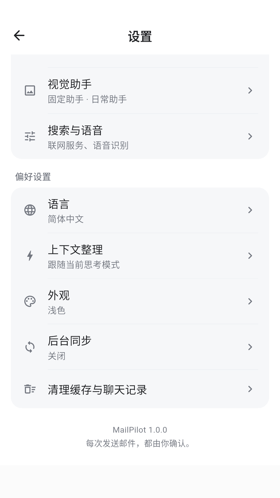
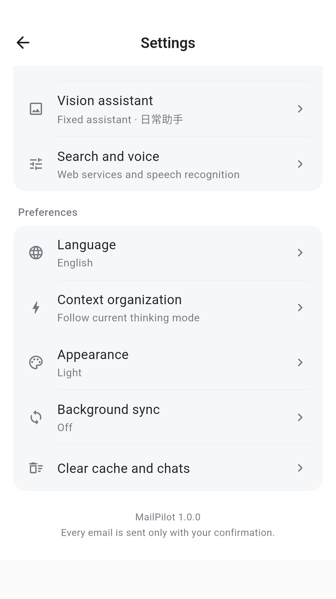
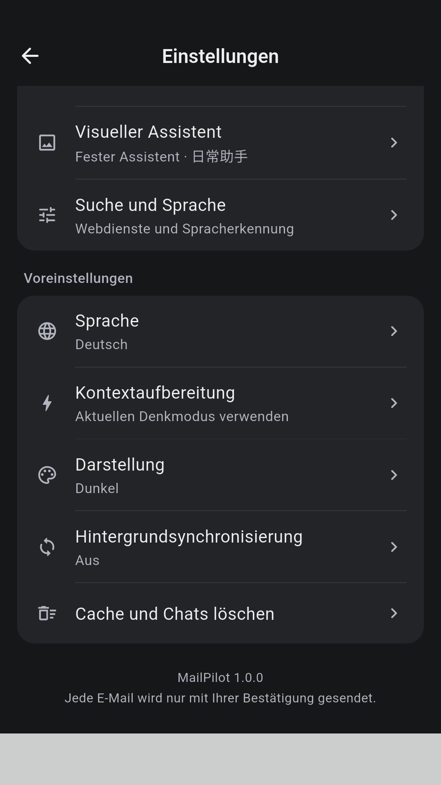

<p align="center"></p>

<h1 align="center">MailPilot</h1>
<p align="center">Conversations IA, lecture des e-mails et réponses dans une seule application Android.</p>
<p align="center"><a href="https://github.com/dongfangshiwen/MailPilot/releases/latest">Télécharger la version 1.0.0</a> · <a href="#quick-start">Premiers pas</a> · <a href="#build">Installation et compilation</a></p>

[简体中文](../../README.md) · [繁體中文](../../docs/readme/README.zh-Hant.md) · [English](../../docs/readme/README.en.md) · [日本語](../../docs/readme/README.ja.md) · [한국어](../../docs/readme/README.ko.md) · [Español](../../docs/readme/README.es.md) · **Français** · [Deutsch](../../docs/readme/README.de.md)

> **Android 8.0+ · Flutter + Kotlin · 8 langues d’interface**<br>
> Configurez votre propre modèle pour discuter, puis ajoutez une boîte mail si nécessaire. L’application se connecte directement aux services configurés : aucun serveur MailPilot à déployer. Les e-mails ne partent qu’après votre confirmation.

## Fonctionnalités

| Fonction | Utilisation |
| --- | --- |
| **Conversations IA** | Réponses Markdown en continu, raisonnement et activité repliables, changement de modèle, arrêt et nouvelle tentative. |
| **Assistant e-mail** | Connexion IMAP / SMTP, recherche et lecture des messages, analyse du contenu et des pièces jointes sélectionnés. |
| **Images et documents** | Images, PDF, Office et texte. Réutilisation des analyses d’images terminées dans une même conversation, avec possibilité de revérification. |
| **Recherche et sources** | Recherche d’informations publiques via votre service, lecture des liens présents dans les documents et consultation des citations. |
| **Rédaction et envoi** | Transformez une réponse en e-mail, modifiez les destinataires et les pièces jointes, puis vérifiez la carte de confirmation avant l’envoi. |
| **Gestion des conversations** | Recherche, classement par date, épinglage, renommage et sélection multiple dans la barre latérale. Les résumés conservent les messages d’origine. |
| **Préférences** | Huit langues, thèmes clair et sombre, saisie vocale et synchronisation facultative, notamment une fois par jour. |

## Aperçu de l’interface

<p align="center">
  
  
  
</p>

Réglages en chinois simplifié, anglais et allemand avec thème sombre. Les captures utilisent une configuration d’exemple, sans identifiants réels.

<a id="quick-start"></a>
## Premiers pas

1. **Installez l’application** : téléchargez l’APK depuis Releases. Pour conserver les données lors d’une mise à jour, utilisez un paquet portant la même signature.
2. **Ajoutez un modèle** : Paramètres → Modèles et services → Ajouter un modèle. Indiquez le fournisseur, la Base URL HTTPS, le modèle et la clé API. DeepSeek, Volcengine Ark, Alibaba Cloud Model Studio et les interfaces compatibles sont configurables ; les capacités dépendent du modèle.
3. **Commencez à discuter** : posez une question ou ajoutez des images et fichiers avec le bouton +. Aucun compte e-mail n’est nécessaire pour discuter avec l’IA.
4. **Connectez une boîte mail (facultatif)** : ajoutez un compte dans les paramètres. Choisissez QQ, 163, Alibaba Mail ou IMAP / SMTP personnalisé. Activez ces services chez le fournisseur et utilisez le code d’autorisation ou mot de passe d’application requis.
5. **Lisez et répondez** : ouvrez Mes e-mails dans les paramètres et synchronisez. Dans la conversation, utilisez + → Sélectionner des e-mails, vérifiez les pièces jointes et demandez une analyse ou un brouillon. Contrôlez destinataires, texte et pièces jointes avant de confirmer.
6. **Personnalisez** : configurez Recherche et voix, puis la langue, l’apparence et la synchronisation dans Préférences. Le chinois simplifié est la langue initiale. La langue d’interface ne traduit pas automatiquement les e-mails ni les réponses du modèle.

### Exemples de demandes

- « Résume les e-mails sélectionnés : délais, montants et points à confirmer. »
- « Compare les caractéristiques de ces images en citant les sources. »
- « Prépare une réponse en anglais à partir de ces conclusions et laisse-moi la vérifier. »

### Pièces jointes prises en charge

| Type | Traitement |
| --- | --- |
| JPG / PNG / WebP | Analyse par le modèle de vision configuré |
| PDF | Pages sélectionnées converties en images ; les 10 premières par défaut |
| DOCX / XLSX / PPTX | Extraction locale du texte, des tableaux et des images intégrées |
| TXT | Lecture locale ; convertir d’abord les anciens DOC / XLS / PPT |

Par tour : 10 pièces jointes, 50 MB au total et 20 éléments visuels au maximum ; 20 MB par pièce jointe. Les requêtes encodées respectent aussi la limite de 32 MiB de l’application et celles du fournisseur. Réduisez la sélection ou choisissez le traitement par lots en cas de dépassement.

<a id="build"></a>
## Installation et compilation

L’application tourne sur Android, sans Docker, serveur de base de données ou backend API distinct. Saisissez les identifiants dans les paramètres de l’application, pas dans le code. Le Web sert uniquement à prévisualiser une interface d’exemple.

### Environnement de compilation

| Composant | Version validée |
| --- | --- |
| Flutter / Dart | 3.47.2 / 3.13.2 |
| JDK | 17–25 |
| Android SDK / Build Tools | 36 / 36.0.0 |
| NDK / CMake | 28.2.13676358 / 3.22.1 |
| Gradle / AGP | 9.3.1 / 9.1.0 |

Installez Flutter et Android Studio, ajoutez Flutter au PATH et installez les composants Android ci-dessous via SDK Manager. Adaptez le chemin du JDK à votre ordinateur. Le téléchargement initial des dépendances nécessite Internet.

```powershell
git clone https://github.com/dongfangshiwen/MailPilot.git
cd MailPilot
flutter doctor

$env:MAILPILOT_JAVA_HOME = "C:\Program Files\Android\Android Studio\jbr"
.\scripts\Build.ps1 -Mode Debug
.\scripts\Build.ps1 -Mode Release
.\scripts\Package-Delivery.ps1
```

Debug utilise le paquet isolé `app.mailpilot.validation` ; Release utilise `app.mailpilot`. Les scripts créent la configuration SDK locale. La première compilation Release crée `.signing/` : conservez-le pour les mises à jour. Une nouvelle clé ne peut pas mettre à jour une installation signée avec la clé officielle.

### Fichiers générés · artifacts/

| Fichier | Contenu |
| --- | --- |
| `MailPilot-1.0.0-flutter-release.apk` | Installateur Android |
| `MailPilot-1.0.0-flutter-source.zip` | Sources, scripts, documentation et captures |
| `MailPilot-1.0.0-flutter-delivery.zip` | Archive complète avec APK et sources |
| `*.sha256` | Empreinte SHA-256 du fichier correspondant |

### Tests

```powershell
.\scripts\Build.ps1 -Mode Test
adb devices
.\scripts\Test-Profile.ps1 -Device emulator-5554 -Mode Debug -Target integration_test/language43_test.dart
```

Remplacez l’identifiant du périphérique par celui de `adb devices`. Les tests UI utilisent un paquet isolé qui reste installé. Ne lancez pas directement `flutter drive` sur votre application quotidienne.

La mise à jour linguistique a passé 489 tests Flutter, 3 tests natifs de langue et la validation isolée API36. Lint indique 0 erreur et 13 avertissements. Les 72 cas de mise en page couvrent huit langues, trois largeurs et l’agrandissement du texte. Voir le rapport détaillé ci-dessous.

### Aperçu dans le navigateur

```powershell
flutter run -d chrome -t lib/main_preview.dart
```

L’aperçu utilise des e-mails d’exemple et des réponses simulées, sans connexion aux services réels. Il ne constitue pas un client e-mail Web pris en charge.

## Structure du projet

```text
MailPilot/
├── lib/                    # Flutter UI
│   └── l10n/               # ARB resources & generated localizations
├── android/app/src/main/   # Android services & Agent
├── test/                   # Flutter tests
├── integration_test/       # Isolated UI tests
├── scripts/                # Windows build & packaging
└── docs/                   # Guides, reports & screenshots
```

Flutter gère l’interface et appelle Kotlin par des canaux de plateforme. Android gère l’Agent, les e-mails, les pièces jointes, Room et DataStore. Après modification des ARB dans `lib/l10n/`, exécutez `flutter gen-l10n`.

## Données et envoi

- Les codes d’autorisation et clés API sont chiffrés avec Android Keystore. Les conversations, pièces jointes et caches restent dans le stockage privé de l’application.
- Lors d’une question, les documents sélectionnés sont transmis au modèle configuré. La recherche et la voix dans le cloud sollicitent leurs services respectifs et peuvent entraîner des frais.
- La lecture Web est en lecture seule. Connexions, CAPTCHA et certains sites dynamiques peuvent bloquer l’extraction ; tous les liens ne sont pas garantis lisibles.
- L’envoi nécessite toujours votre confirmation. La synchronisation en arrière-plan est désactivée par défaut et n’analyse ni n’envoie automatiquement de messages.
- La désinstallation supprime les données locales. Les archives excluent clés de signature, configuration personnelle et bases de données. Sauvegardez `.signing/` séparément si vous développez l’application.

## Pour aller plus loin

- [Configurer les e-mails](../../docs/MAIL_SETUP.md)
- [Huit langues et rapport de tests](../../docs/LOCALIZATION_1_0_0_BUILD_43.md)
- [Historique des versions](../../docs/CHANGELOG.md)
- [Composants tiers](../../docs/THIRD_PARTY.md)

Le README existe en huit langues. Les documents techniques détaillés sont principalement en chinois simplifié.
